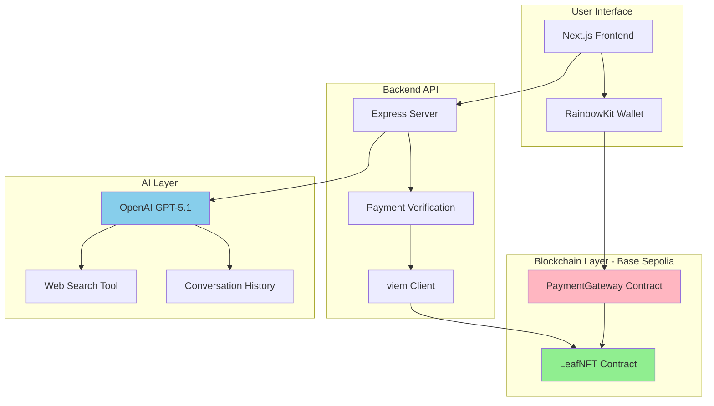

# 🍃 Leaf - AI Digital Replicas on Chain

**Immortalize your personality and interests on-chain. Chat with AI replicas powered by blockchain payments.**

Leaf is a decentralized platform for creating AI digital replicas ("Leaves") that live on the blockchain. Each Leaf is an NFT with a unique personality that users can interact with by paying per message.

## Architecture



## Features

- **On-Chain Leaves**: Each AI replica is an ERC-721 NFT with unique personality traits stored on-chain
- **Public Leaf Creation**: Anyone can create their own Leaf by paying a 0.01 ETH creation fee
- **Pay-Per-Message**: Users pay ETH for each message they send to a Leaf
- **Revenue Split**: 70% to Leaf owner, 30% to platform treasury
- **Real-Time Web Search**: GPT-5.1 with internet access for current information
- **Ephemeral Conversations**: Conversations are volatile memories, not stored anywhere
- **Hibernation Mode**: Owners can pause/resume their Leaves

## Tech Stack

### Smart Contracts
- **Solidity 0.8.24** with OpenZeppelin
- **Foundry** for development and testing
- **Base Sepolia** testnet deployment

### Backend
- **Node.js + TypeScript** with Express
- **OpenAI GPT-5.1** with Responses API
- **viem** for blockchain interactions

### Frontend
- **Next.js 14** with React 19
- **RainbowKit** for wallet connections
- **wagmi v3** for contract interactions
- **Tailwind CSS** for styling

## Current Status

### ✅ Completed
- Smart contract development and deployment
- Public leaf creation with 0.01 ETH creation fee
- Leaf management interface (/my-leaves)
- Backend API with payment verification
- Frontend with wallet integration
- GPT-5.1 integration with web search
- Real-time conversation context (ephemeral, not stored)

### 🎯 Philosophy

Leaves are **thermal laminates** - sealed personalities on-chain. Each Leaf is an immutable NFT with a personality note that defines how it responds. Conversations are ephemeral "volatile memories" that exist only during the chat session - no conversation history is stored anywhere.

**This design ensures:**
- Simple, predictable behavior
- No complex data storage infrastructure needed
- True decentralization (everything on-chain or computed on-demand)
- Clear value proposition: pay to chat with a personality, not a database

## Quick Start

### Prerequisites
- Node.js v18+
- Foundry
- Base Sepolia ETH (from [Base Sepolia Faucet](https://www.coinbase.com/faucets/base-ethereum-sepolia-faucet))

### Setup

1. **Clone and install dependencies**
```bash
git clone <repo-url>
cd leaf-on-chain

# Install backend dependencies
cd backend && npm install

# Install frontend dependencies
cd ../frontend && npm install
```

2. **Configure environment variables**

Backend (`backend/.env`):
```bash
OPENAI_API_KEY=your_openai_api_key
LEAF_NFT_ADDRESS=0xfcD5AF2353526fE9513EE77F98eD2Bc21127C72a
PAYMENT_GATEWAY_ADDRESS=0xCEFA131cDFA9B966AF23df46c7D6d8e3d5872b02
```

Frontend (`frontend/.env.local`):
```bash
NEXT_PUBLIC_API_URL=http://localhost:3001
NEXT_PUBLIC_LEAF_NFT_ADDRESS=0xfcD5AF2353526fE9513EE77F98eD2Bc21127C72a
NEXT_PUBLIC_PAYMENT_GATEWAY_ADDRESS=0xCEFA131cDFA9B966AF23df46c7D6d8e3d5872b02
NEXT_PUBLIC_WALLETCONNECT_PROJECT_ID=your_project_id
```

3. **Run the application**

```bash
# Terminal 1 - Backend
cd backend && npm run dev

# Terminal 2 - Frontend
cd frontend && npm run dev
```

Visit `http://localhost:3000` and connect your wallet!

## Deployed Contracts (Base Sepolia)

- **LeafNFT**: [`0xfcD5AF2353526fE9513EE77F98eD2Bc21127C72a`](https://sepolia.basescan.org/address/0xfcD5AF2353526fE9513EE77F98eD2Bc21127C72a)
- **PaymentGateway**: [`0xCEFA131cDFA9B966AF23df46c7D6d8e3d5872b02`](https://sepolia.basescan.org/address/0xCEFA131cDFA9B966AF23df46c7D6d8e3d5872b02)

## How It Works

1. **Create a Leaf**: Visit `/create`, fill out the form (name, personality note, price), pay 0.01 ETH creation fee
2. **Leaf is Minted**: NFT minted to your wallet with personality sealed on-chain
3. **Users Discover**: Others find your Leaf and connect their wallet
4. **Pay to Chat**: Each message requires on-chain payment (verified by backend)
5. **AI Responds**: GPT-5.1 generates response based on Leaf's personality note with web search access
6. **Revenue Split**: Payment automatically distributed (70% to you, 30% to platform treasury)
7. **Manage Your Leaf**: View your leaves at `/my-leaves`, update settings anytime

## Development

### Run Tests
```bash
cd contracts
forge test -vv
```

### Deploy Contracts
```bash
cd contracts
forge script script/Deploy.s.sol --rpc-url base-sepolia --broadcast --verify
```

## License

MIT

## Contributing

Contributions welcome! Please open an issue or PR.

---

**Note**: This is experimental software. Use at your own risk. Not audited for production use.
