# 🍃 Leaf - AI Digital Replicas on Chain

**Immortalize your personality and interests on-chain. Chat with AI replicas powered by blockchain payments.**

Leaf is a decentralized platform for creating AI digital replicas ("Leaves") that live on the blockchain. Each Leaf is an NFT with a unique personality that users can interact with by paying per message.

## Architecture


## Features

- **On-Chain Leaves**: Each AI replica is an ERC-721 NFT with unique personality traits
- **Pay-Per-Message**: Users pay ETH for each message they send to a Leaf
- **Revenue Split**: 70% to Leaf owner, 30% to platform treasury
- **Real-Time Web Search**: GPT-5.1 with internet access for current information
- **Conversation Memory**: Full context retention across messages
- **Hibernation Mode**: Owners can pause/resume their Leaves

## Tech Stack

### Smart Contracts
- **Solidity 0.8.24** with OpenZeppelin
- **Foundry** for development and testing
- **Base Sepolia** testnet deployment

### Backend
- **Node.js + TypeScript** with Express
- **OpenAI GPT-5.1** with Responses API
- **viem** for blockchain interactions

### Frontend
- **Next.js 14** with React 19
- **RainbowKit** for wallet connections
- **wagmi v3** for contract interactions
- **Tailwind CSS** for styling

## Current Status

### ✅ Completed
- Smart contract development and deployment
- Backend API with payment verification
- Frontend with wallet integration
- GPT-5.1 integration with web search
- Conversation history support

### 🚧 Work in Progress

**Leaf Knowledge Distillation Pipeline** - A system to transform real user conversations into Leaf personalities:

```mermaid
graph LR
    A[User ↔ Agent Chat] --> B[CLI Conversations]
    B --> C{Distillation Process}
    C --> D[skills.md]
    C --> E[personality.md]
    C --> F[thinking.md]
    D --> G[Leaf Context]
    E --> G
    F --> G
    G --> H[Decentralized Vector DB]
    H --> I[Context Retrieval]
    I --> J[On-Chain Leaf NFT]
    J --> K[AI Response w/ RAG]

    style C fill:#FFD700
    style G fill:#90EE90
    style H fill:#9370DB
```



**The vision:** Normal CLI conversations with AI agents get analyzed and distilled into structured knowledge files (skills, personality patterns, thinking processes), which then form the contextual foundation for creating personalized Leaves on-chain.

**Planned enhancements:**
- **Decentralized Search/Vector DB**: Store distilled knowledge in decentralized vector databases (e.g., IPFS + semantic search, Ceramic, or other Web3 storage)
- **RAG (Retrieval-Augmented Generation)**: Enable Leaves to retrieve relevant context from their knowledge base during conversations
- **Dynamic Context**: Allow Leaves to evolve and grow their knowledge over time based on new interactions
- **Knowledge Ownership**: All distilled knowledge remains cryptographically tied to the Leaf NFT owner

## Quick Start

### Prerequisites
- Node.js v18+
- Foundry
- Base Sepolia ETH (from [Base Sepolia Faucet](https://www.coinbase.com/faucets/base-ethereum-sepolia-faucet))

### Setup

1. **Clone and install dependencies**
```bash
git clone <repo-url>
cd leaf-on-chain

# Install backend dependencies
cd backend && npm install

# Install frontend dependencies
cd ../frontend && npm install
```

2. **Configure environment variables**

Backend (`backend/.env`):
```bash
OPENAI_API_KEY=your_openai_api_key
LEAF_NFT_ADDRESS=0xaf2a611DA49ee732F29909016ABb8099A3E5371A
PAYMENT_GATEWAY_ADDRESS=0xFE9E089D4b751D1D02596261B9522660C9807E1E
```

Frontend (`frontend/.env.local`):
```bash
NEXT_PUBLIC_API_URL=http://localhost:3001
NEXT_PUBLIC_LEAF_NFT_ADDRESS=0xaf2a611DA49ee732F29909016ABb8099A3E5371A
NEXT_PUBLIC_PAYMENT_GATEWAY_ADDRESS=0xFE9E089D4b751D1D02596261B9522660C9807E1E
NEXT_PUBLIC_WALLETCONNECT_PROJECT_ID=your_project_id
```

3. **Run the application**

```bash
# Terminal 1 - Backend
cd backend && npm run dev

# Terminal 2 - Frontend
cd frontend && npm run dev
```

Visit `http://localhost:3000` and connect your wallet!

## Deployed Contracts (Base Sepolia)

- **LeafNFT**: [`0xaf2a611DA49ee732F29909016ABb8099A3E5371A`](https://sepolia.basescan.org/address/0xaf2a611DA49ee732F29909016ABb8099A3E5371A)
- **PaymentGateway**: [`0xFE9E089D4b751D1D02596261B9522660C9807E1E`](https://sepolia.basescan.org/address/0xFE9E089D4b751D1D02596261B9522660C9807E1E)

## How It Works

1. **Create a Leaf**: Mint an NFT with a personality description and price per message
2. **Users Connect**: Connect wallet via RainbowKit
3. **Pay to Chat**: Each message requires on-chain payment (verified by backend)
4. **AI Responds**: GPT-5.1 generates response based on Leaf's personality
5. **Revenue Split**: Payment automatically distributed (70% owner, 30% treasury)

## Development

### Run Tests
```bash
cd contracts
forge test -vv
```

### Deploy Contracts
```bash
cd contracts
forge script script/Deploy.s.sol --rpc-url base-sepolia --broadcast --verify
```

## License

MIT

## Contributing

Contributions welcome! Please open an issue or PR.

---

**Note**: This is experimental software. Use at your own risk. Not audited for production use.
